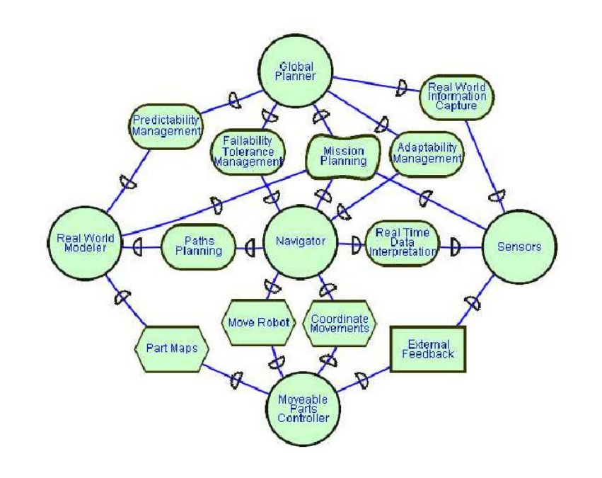

# Existing Architecture 
## Architecture Sequentielle 
    Les premières architectures de contrôle pour des robots autonomes s’articulaient autour d’une
    décomposition du système en trois sous-parties, appelées séquentiellement, à savoir la perception, la planification, puis l’exécution (paradigme nommé SPA 1
    ) (Nilsson, 1980). Le sous-système
    de perception construit un modèle de l’environnement à partir des données perçues, puis la planification calcule un plan sur la base de ce modèle, i.e. une séquence d’actions pour atteindre
    le but, qui est exécuté par le sous-système d’exécution (cf figure 3.1). L’exécution étant à priori
    un problème simple, la majorité des travaux se concentre sur les phases de modélisation et de
    planification
    Toutefois, comme l’analyse E. Gat dans (Gat, 1991b), cette approche présente deux problèmes majeurs. Tout d’abord, la planification et la modélisation sont des problèmes très difficiles, surtout considérés au niveau global d’un robot. Ensuite, l’exécution des plans en boucle
    ouverte n’est pas satisfaisante dans un environnement dynamique. Deux grandes alternatives apparurent pour répondre à ces défis : les architectures réactives et les architectures dites “en couches”.
## Architectures réactives
    L’architecture Subsumption (Brooks, 1990) propose de décomposer les différents processus
    d’un robot en un ensemble de comportements élémentaires (possiblement liés), qui sont représentés par des petites machines à états finis. Pour construire des comportements plus complexes,
    Brooks introduit la notion d’inhibition qui va modifier le contenu d’un lien par la valeur d’un
    autre. Cette architecture a démontré des résultats très intéressants pour la navigation et l’évitement d’obstacles. Toutefois, d’après R. Hartley (Hartley and Pipitone, 1991), l’architecture
    Subsumption manque d’outils pour gérer la complexité, et il lui est donc difficile de coordonner
    des tâches de plus haut niveau.
## Systèmes multi-agents
    En s’inspirant des grandes lignes des architectures réactives, de nombreux systèmes multiagents sont apparus. Le problème clef de ces architectures est la sélection et la coordination des
    bons comportements au moment courant.
## Une approche temps-réel 
    L’architecture artis (Soler et al., 2000) définit un ensemble d’agents
    temps-réels, et les ordonnance selon un ensemble de priorité fixes. Cette approche garantit des
    propriétés temps réel dur, mais limite la flexibilité de l’architecture, et ses possibilités de reconfiguration. Ces exigences sont nécessaires dans certains domaines, mais sont probablement trop
    drastiques en général pour un robot accomplissant des tâches plus complexes.
## Une approche basée enchère 
    Dans (Busquets et al., 2003), D. Busquets propose une architecture où les agents se coordonnent à l’aide d’un système d’enchères. Une enchère dans ce cadre est un réel dans l’intervalle [0, 1] et indique si une opération est nécessaire plus ou moins rapidement. Ce système d’enchères permet de sélectionner l’action courante à exécuter et donc d’éviter les problèmes de concurrence au matériel. Toutefois, ce système d’enchères centralise
    la décision dans un unique agent, l’échec de celui-ci entraîne donc l’arrêt complet du système.
    De plus, chaque agent utilise une fonction d’enchère qui lui est propre, on peut se demander si
    ce système permet, quelque soit la fonction enchère de chaque agent, d’avoir un comportement
    global cohérent.

## De la théorie de l’organisation 
    Les travaux de P. Giorgini (Giorgini et al., 2001) analysent différentes stratégies de coordination, certaines classiques (boucle fermée, architecture en couches), et d’autres venant desthéories de l’organisation (structure-en-5, coentreprise 6
    ). Dans la structureen-5 (montrée figure 3.2), le robot est décomposé en cinq sous-systèmes importants qui sont
    placés dans une configuration initiale, avec au centre un agent qui coordonne les mouvements
    du robot et gère les différentes fautes. Dans le cas de la coentreprise (présentée figure 3.3), le
    système est organisé autour d’un agent central manager, jouant d’un côté le rôle de coordinateur
    et de l’autre d’interface de contrôle pour définir les missions. Ces différents types d’organisations sont analysés sous l’angle de quatre thématiques : coordination, prévisibilité, tolérance aux
    fautes, et adaptabilité. Au vu de ces critères, les méthodes structure-en-5 et coentreprise sont plus
    efficaces que les méthodes classiques d’organisation. Toutefois, l’étude reste théorique, et autant
    que nous le sachons, il n’existe pas d’implémentation effective de ces architectures sur un robot
    réel. De plus, ces deux propositions ont un point de décision central unique, créant ainsi un point
    de faiblesse unique (il peut fauter, ou mettre de plus en plus longtemps à prendre une décision).

## Une approche décentralisée
    Au contraire, (Innocenti et al., 2007) propose une architecture
    complètement décentralisée, en utilisant la logique floue pour coordonner les différents agents.
    Ces travaux sont illustrés par la fusion de deux contrôleurs pour une tâche de navigation. Toutefois, la fusion correcte de ces contrôleurs grâce à la logique floue dépend de plusieurs paramètres
    définis empiriquement. Cela pose le problème de la généricité de l’approche : si certains paramètres doivent être redéfinis manuellement à chaque ajout ou suppression d’un contrôleur, la
    solution proposée reste relativement spécifique à un problème donné. Enfin, on a vu précédemment que des architectures réactives comme Subsumption étaient efficace pour des tâches de
    navigation mais avaient des difficultés pour contrôler des tâches plus complexes. On peut donc
    légitimement se demander si cette architecture peut coordonner des tâches plus complexes que
    la navigation.

